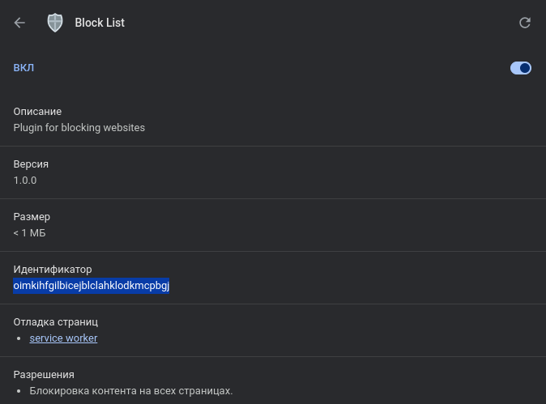

# Block List - Chrome Extensions

## Server

```bash
# перейти в папку server
$ cd server

# установить зависимости
$ npm i

# поднять postgres
$ docker-compose up

# запустить приложение
$ npm run start:dev
```

Swagger будет доступен по адресу `http://localhost:3000/api`

## Client

```bash
# перейти в папку client
$ cd client

# установить зависимости
$ npm i

# запустить приложение
$ npm run dev
```

Приложение будет доступно по адресу `http://localhost:3001`

## Extension

```bash
# перейти в папку extension
$ cd extension

# установить зависимости
$ npm i

# собрать приложение
$ npm run build
```

Результатом сборки будет папка `dist`


В браузере Chrome необходимо открыть страницу с расширениями, включить режим разработчика и перетащить папку dist в область списка расширений 


Для настройки CORS нужно нажать на "Сведения" и скопировать id расширения. Перейти в папку server и обновить в файле `.env` значение `EXTENSION_URL`



## TODO

- Зашифровать пароль при авторизации/регистрации
- Для проверки авторизации в расширении сделан polling через 3 секунды. Сделать через events или long pulling
- Нет визуальной связи "расширение - клиент" при активации блокировки (связь "клиент - расширение" есть). Сделать через long pulling
